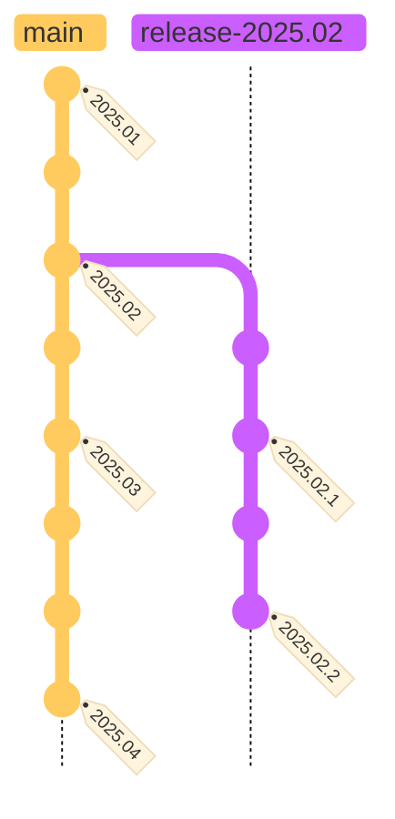
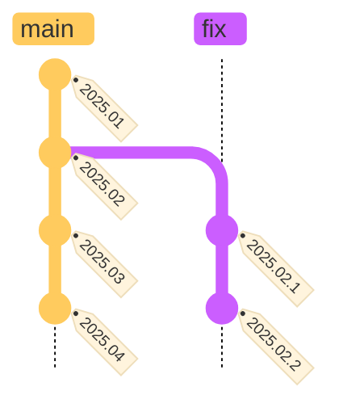

# tech-coach-internal-test og tech-coach-public-test

Disse to repoene demonstrerer hvordan man automatisk kan publisere kode fra et internt
repository (repo) til et offentlig (public) repo.
Publisering utløses når en *commit* i det interne repoet får en *tag* (merkelapp),
typisk når man lager en *release*.

## Hvorfor

Hver gang man publiserer en statistikk, bør man lage en tilhørende release av koden som
ble brukt til å produsere statistikken.
Dette gjør det enkelt å finne tilbake til riktig kode i ettertid.

Allmennheten har krav på innsyn i kode som er brukt til å produsere publisert statistikk,
med mindre sikkerhetshensyn tilsier noe annet.
Se [Offentlighetsloven og rett til innsyn i kildekode].
Offentlige repoer gjør at man slipper saksbehandling rundt innsynsbegjæringer i koden.

I tillegg er åpenhet og gjennomsiktighet viktig for å skape tillit.
Derfor bør mest mulig av koden og dokumentasjonen vi skriver være åpent tilgjengelig,
på lik linje med statistikken vi produserer.
At offentlig finansierte løsninger er mest mulig tilgjengelige, er et viktig prinsipp.

## Hvordan

To GitHub Actions-workflower gjør jobben: [push-to-public-repo.yml] og [autotag-public-repo.yml].

Når det opprettes en *tag* i det interne repoet, kopieres koden som taggen refererer til
over til det tilhørende offentlige repoet, og det opprettes en *pull request* der.
Dette gjøres av workflowen [push-to-public-repo.yml].

Etter at *pull request*-en i det offentlige repoet er *merget* (flettet) til main,
sørger [autotag-public-repo.yml] for at det offentlige repoet automatisk tagges med samme
tag som ble brukt i det interne repoet.

Resultatet er et offentlig repo som kun består av kode som har inngått i en release.

### Illustrasjoner

I diagrammene nedenfor er git-commitene vist fra topp til bunn.
Diagrammene er forenklede: I det interne repoet kan det finnes flere utviklingsgrener (branches) som ikke er vist her.

Hovedpoenget er at releaser i utgangspunktet lages fra versjoner på *main*-grenen,
med unntak av feilrettinger på tidligere releaser.
Slike feilrettinger gjøres på en egen release-branch for den aktuelle releasen.

#### Internt repo

#### Offentlig (public) repo

---

Se filen [SYNC_WORKFLOW_SETUP.md](SYNC_WORKFLOW_SETUP.md) for flere detaljer og instruksjoner.

[autotag-public-repo.yml]: https://github.com/statisticsnorway/tech-coach-internal-test/blob/main/.github/workflows/autotag-public-repo.yml
[push-to-public-repo.yml]: https://github.com/statisticsnorway/tech-coach-internal-test/blob/main/.github/workflows/push-to-public-repo.yml
[Offentlighetsloven og rett til innsyn i kildekode]: https://statistics-norway.atlassian.net/wiki/spaces/BEST/pages/3069476887/Offentlighetsloven+og+rett+til+innsyn+i+kildekode
